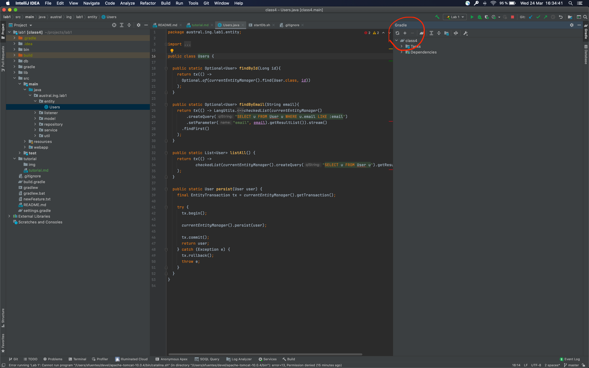
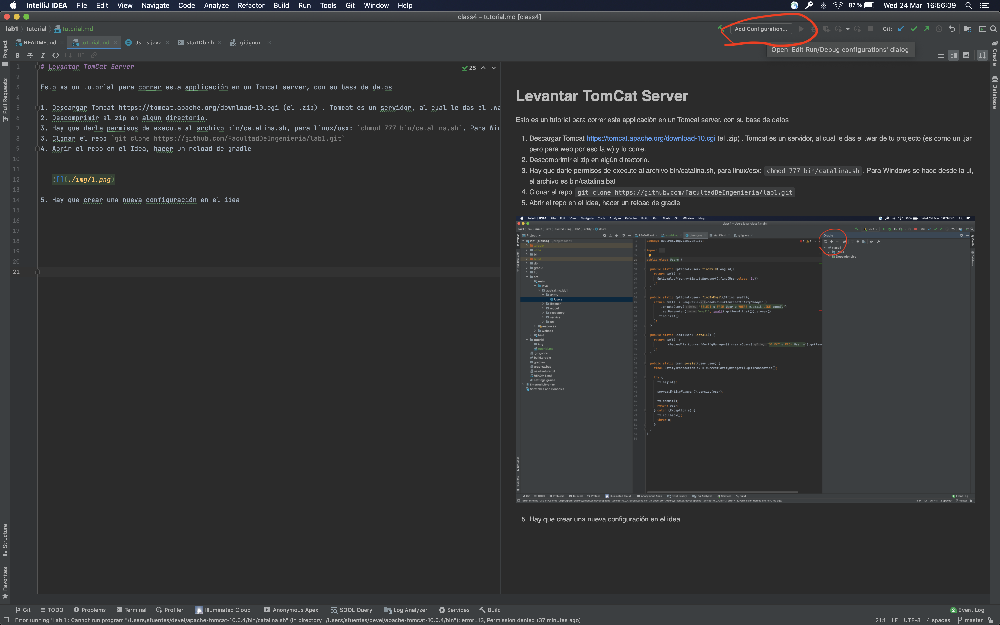
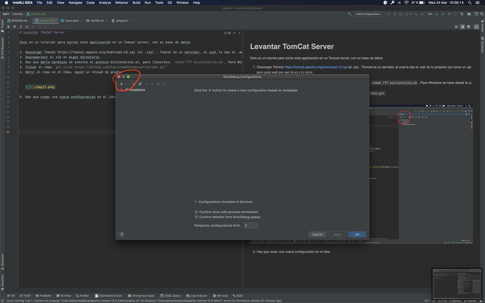
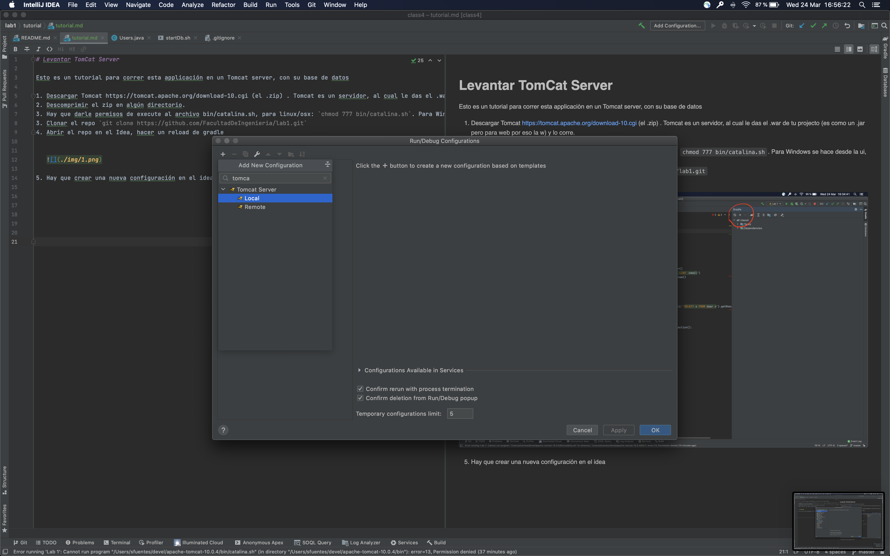
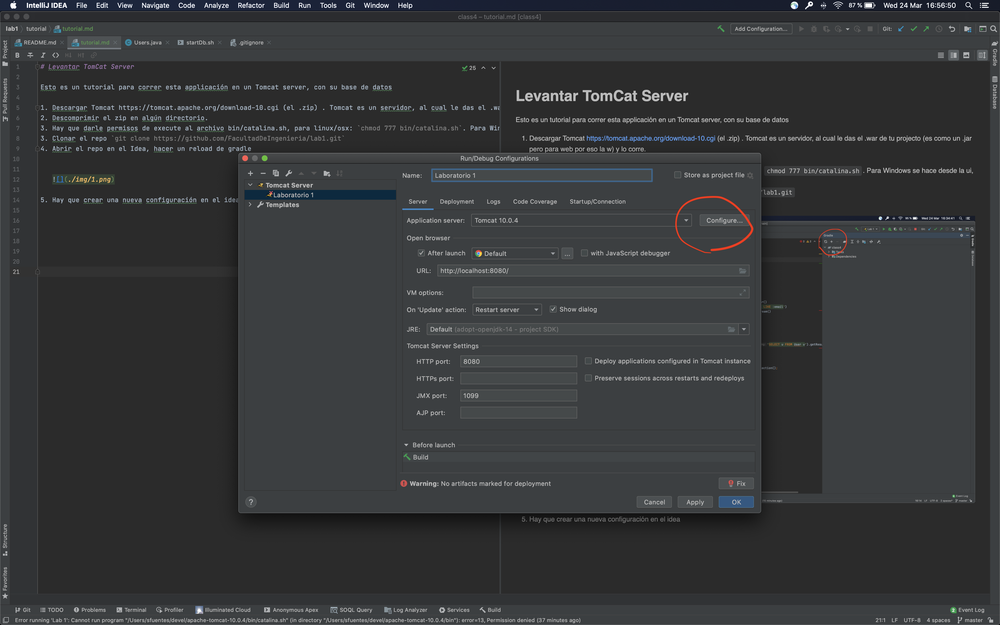
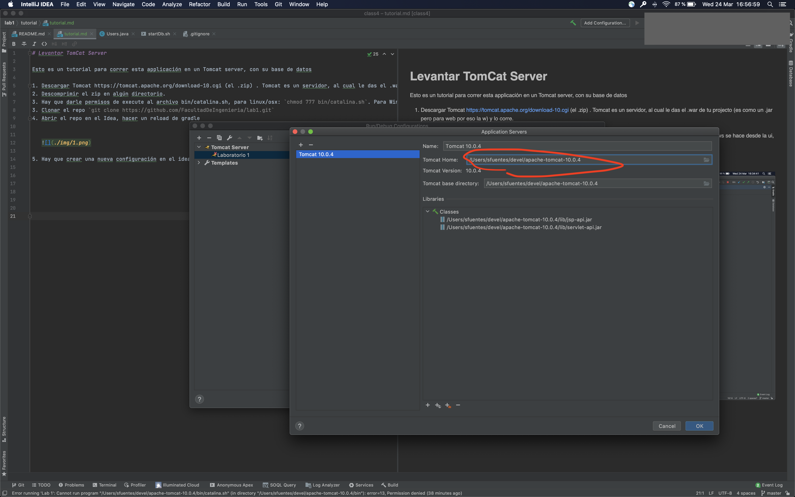
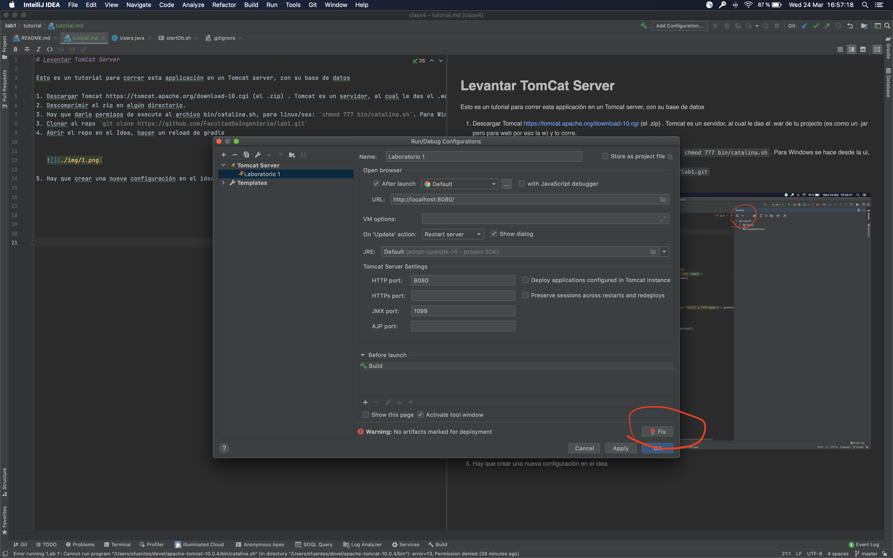
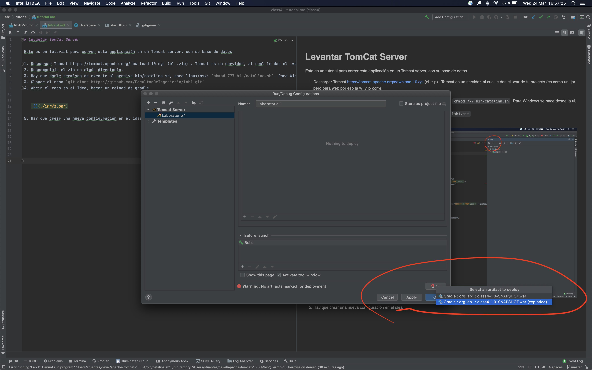
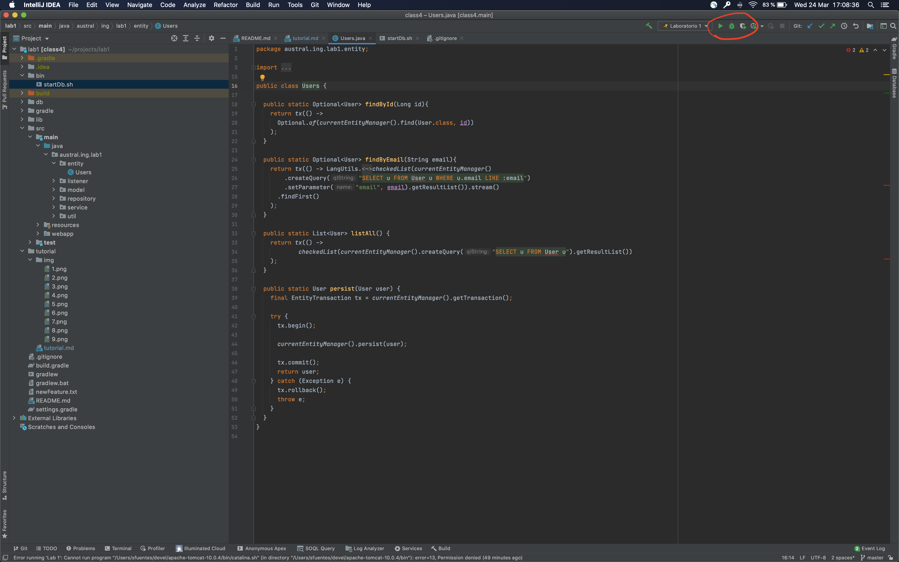
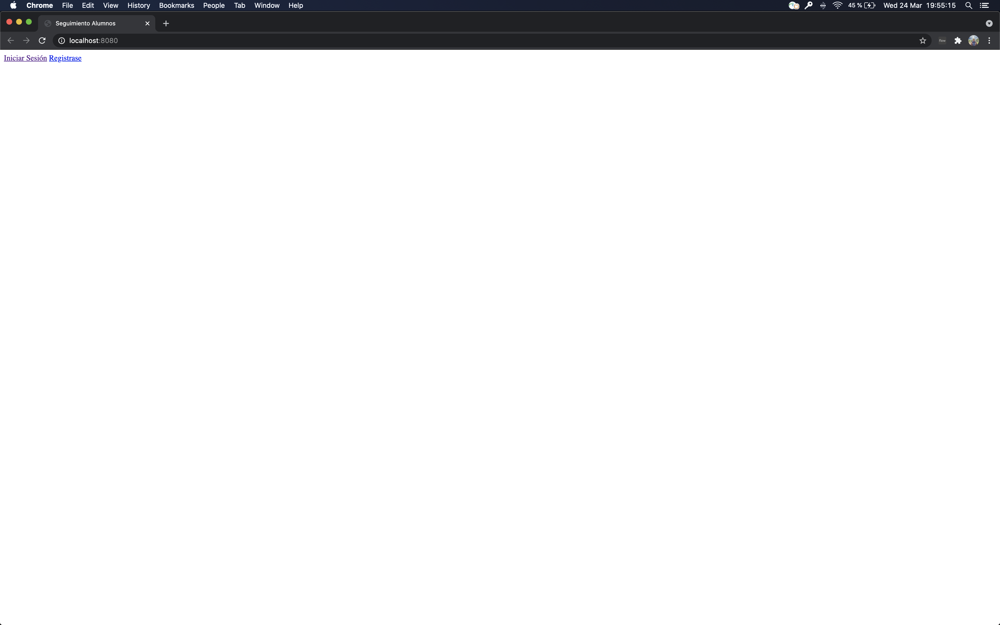

# Levantar TomCat Server

Esto es un tutorial para correr esta applicación en un Tomcat server.

1. Descargar Tomcat https://tomcat.apache.org/download-10.cgi (el .zip) . Tomcat es un servidor, al cual le das el .war de tu projecto (es como un .jar pero para web por eso la w) y lo corre.
2. Descomprimir el zip en algún directorio.
3. Hay que darle permisos de execute al archivo bin/catalina.sh, para linux/osx: `chmod 777 bin/catalina.sh`. Para Windows se hace desde la ui, el archivo es bin/catalina.bat  
3. Clonar el repo `git clone https://github.com/FacultadDeIngenieria/lab1.git`
4. Abrir el repo en el Idea, hacer un reload de gradle

 
   

5. Hay que crear una nueva configuración en el idea, apuntar al Tomcat descomprimido, click en fix, y apuntar al war (exploded)

   
   
   
   
   
   
   
   
   
   
   
   
   
   
   

6. En la tab de **Deployment** en **Application Context** borrar lo que hay y dejar  la barra sola `/`
 

   
6. Levantar la base de datos `cd bin` `./startDb.sh`

7. Darle run a la aplicación, somos desarrolladores asi que siempre en debug mode

   

8. Entren a *localhost:8080/*

